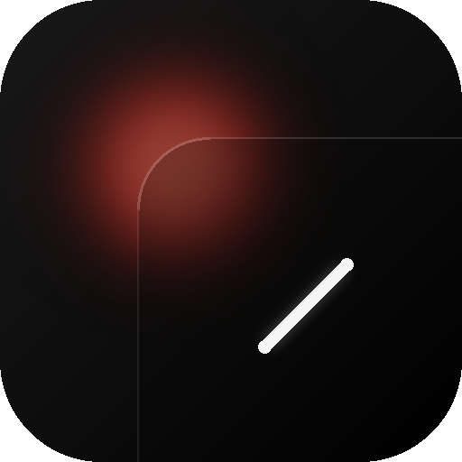

  
  <h1>PAC Barinas</h1>
  
<b>El Sistema Oficial de Telemetría Eléctrica para el Estado Barinas</b>

PAC Barinas es una aplicación nativa para Android diseñada para que los ciudadanos del Estado Barinas puedan monitorear, consultar y recibir notificaciones predictivas sobre el Plan de Administración de Carga (PAC). 

Esta aplicación busca aliviar la incertidumbre de los cortes eléctricos brindando reportes en tiempo real, proyecciones basadas en modelos de inteligencia de datos y notificaciones automáticas para que los usuarios puedan planificarse con anticipación.

## 🚀 Características Principales

- **⏰ Cronograma Interactivo:** Visualiza la matriz oficial de cortes eléctricos semanales organizada por tu bloque o circuito de forma limpia e intuitiva.
- **🔔 Alertas Push en Tiempo Real:** Integración con servicios en la nube para despertar el teléfono y activar alarmas sonoras exactas momentos antes de que inicie el racionamiento eléctrico en tu zona.
- **⚡ Telemetría Comunitaria:** Sistema de reportes en vivo donde cada ciudadano puede reportar si tiene luz o no en su sector, permitiendo crear un mapa térmico de servicio.
- **📲 Widget Inteligente:** Monitoreo directamente desde la pantalla de inicio con soporte de _Glance_. 
- **🔄 Actualizaciones In-App:** Capacidad interna (OTA) para actualizar la aplicación a las versiones más recientes sin depender de tiendas de aplicaciones externas.

## 🛠 Arquitectura y Tecnologías

El proyecto fue desarrollado aplicando las mejores prácticas de ingeniería de software para Android:

- **100% Kotlin y Jetpack Compose:** Interfaces declarativas y responsivas para Android y un rendimiento fluido y eficiente.
- **Arquitectura MVVM limpia:** Separación estricta de responsabilidades usando repositorios, casos de uso (ViewModels) y flujos unidireccionales (StateFlow).
- **Offline-First:** Persistencia con `Room Database`. La aplicación sigue funcionando a la perfección sin conexión a internet y almacena los esquemas de racionamiento localmente.
- **Sincronización en la Nube:** Sistema de sincronización inteligente usando WorkManager y bases de datos NoSQL para obtener datos en tiempo real de cortes y reportes.

## 📱 Requisitos
- Android 7.0 (API 24) o superior.
- Conexión a internet (para sincronización de cortes y telemetría en tiempo real).

## 📄 Licencia

Este proyecto está disponible bajo la [Licencia MIT](LICENSE). 
Puedes clonar, bifurcar y colaborar con el proyecto de forma libre y gratuita.

---
*Hecho por y para la comunidad de Barinas.*
