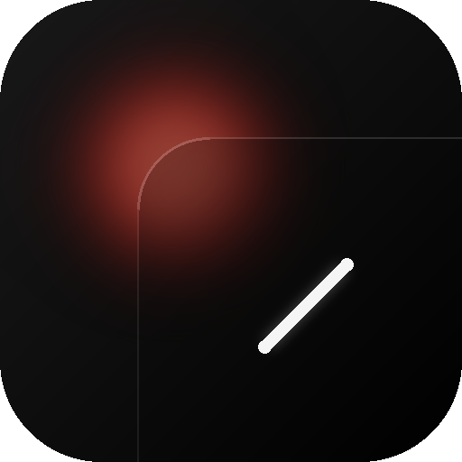

  
  <h1>PAC Barinas 2.0</h1>
  
<b>Sistema Comunitario de Telemetría Eléctrica para el Estado Barinas</b>

PAC Barinas es una aplicación nativa para Android diseñada para que los ciudadanos del Estado Barinas puedan monitorear, consultar y recibir notificaciones predictivas sobre el Plan de Administración de Carga (PAC). 

La nueva versión 2.0 redefine la arquitectura, aliviando la incertidumbre de los cortes eléctricos mediante **algoritmos predictivos comunitarios**, mapas de calor en vivo, notificaciones interactivas y soporte multizona.

## 🚀 Características Principales

- **🤖 Motor Predictivo Ciudadano:** Un nuevo algoritmo que contrasta el cronograma referencial del PAC con el volumen real de reportes de los últimos 7 días, ajustando de forma dinámica las proyecciones de cortes si el comportamiento del proveedor se desvía de la teoría.
- **🗺️ Mapa de Calor Interactivo:** Visualización térmica impulsada por métricas comunitarias. El radio y la intensidad del calor se adaptan en tiempo real al volumen de confirmaciones y cortes en cada sector de Barinas.
- **🔔 Alertas Interactivas de Validación:** Alertas Push exactas que se activan al inicio de tu bloque horario preguntando *¿Se fue la luz?* con botones de respuesta rápida (1-tap) para inyectar telemetría directa desde la notificación.
- **📍 Soporte Multizona (Casa / Trabajo):** Interfaz dual con perfiles de ubicación. Alterna con un toque entre tu residencia y lugar de trabajo, garantizando que el sistema silencie las notificaciones del sector inactivo para evitar distracciones.
- **🎨 Motor de Temas y Ergonomía:** Un nuevo panel de personalización global. Soporte para Modo Oscuro, colores dinámicos (Material You) y ajustes de Escala Visual para adaptar fuentes y espaciados.
- **📱 Optimización para Pantallas Grandes:** El nuevo motor de UI reacciona a pantallas de gran formato (Tablets y Smart TVs > 600dp) colapsando la barra inferior y mostrando un *Navigation Rail* lateral para un uso más ergonómico.
- **🌐 Ecosistema Web Integrado:** Conexión nativa con `pacbarinas.web.app` para sincronización de actualizaciones OTA seguras y un panel de telemetría externo.

## 🛠 Arquitectura y Tecnologías

El proyecto fue reescrito bajo una filosofía estricta de eficiencia y Offline-First:

- **100% Kotlin y Jetpack Compose:** Interfaces declarativas y responsivas que se adaptan a cualquier resolución.
- **Arquitectura MVVM Limpia:** Separación estricta de responsabilidades (Repositorios, ViewModels y StateFlow).
- **Base de Datos Persistente (Room):** La app funciona a la perfección sin conexión a internet en medio de los apagones, gestionando los cronogramas a nivel local.
- **Sincronización Inteligente & WorkManager:** Sistema de reportes perezosos que ahorran batería y enlazan la data bidireccionalmente con Supabase (PostgREST/Realtime) evitando bloqueos reactivos y mitigando el abuso de peticiones a servidores externos.

## 📱 Requisitos
- Android 7.0 (API 24) o superior.
- Pantallas tradicionales, Tablets o Smart TVs Android.
- Conexión a internet esporádica (requerida para reportar y actualizar predicciones comunitarias).

## 👥 Créditos y Reconocimientos

- **💡 Ideación y Concepción del Proyecto:** [ElMatrushka](https://www.facebook.com/elmatrushka.bv/) — Parte fundamental en el surgimiento y formulación de la idea original del sistema PAC Barinas.
- **💻 Desarrollo y Arquitectura de Software:** Ing. Jorluis — Desarrollo móvil nativo Android, plataforma web y telemetría.
- **🤝 Comunidad de Barinas:** Todos los ciudadanos y comercios que día a día alimentan el mapa de telemetría ciudadana.

---
*Desarrollado de forma comunitaria por y para los ciudadanos del Estado Barinas.*
